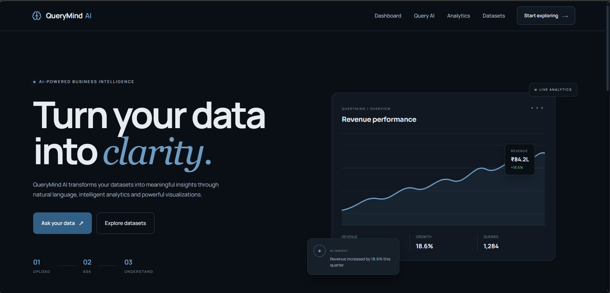
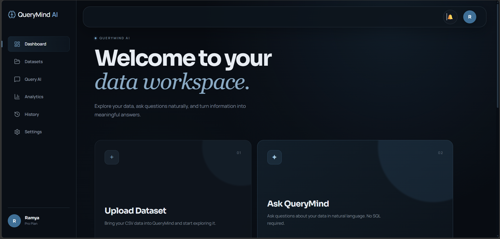
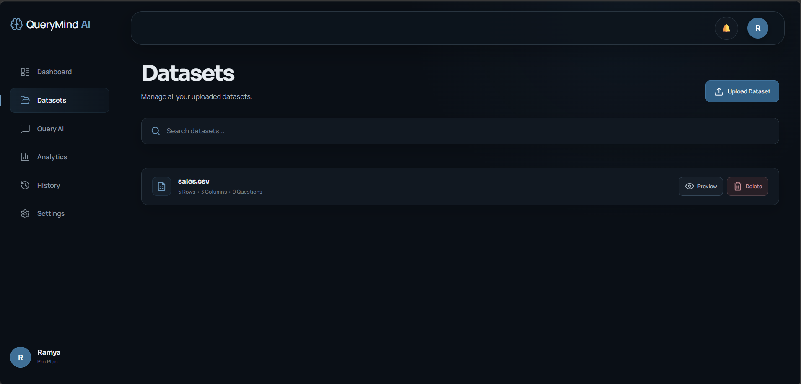
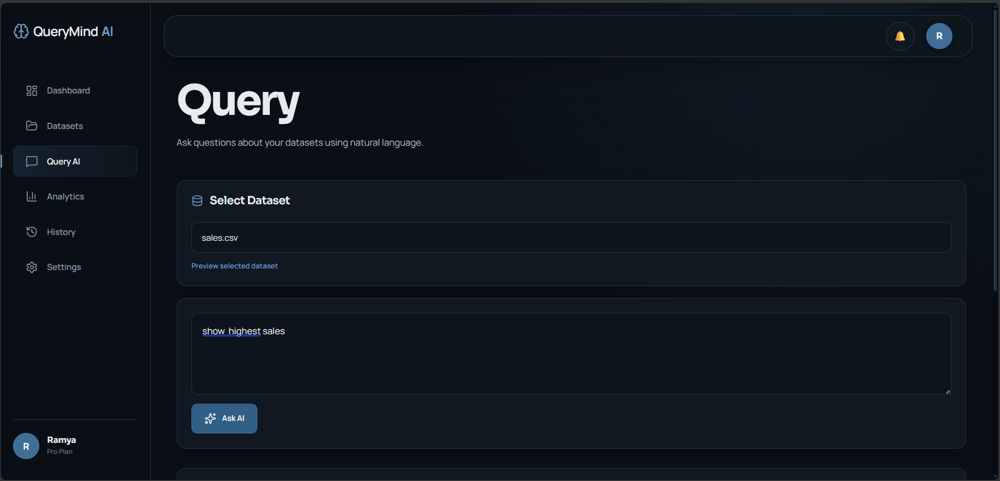
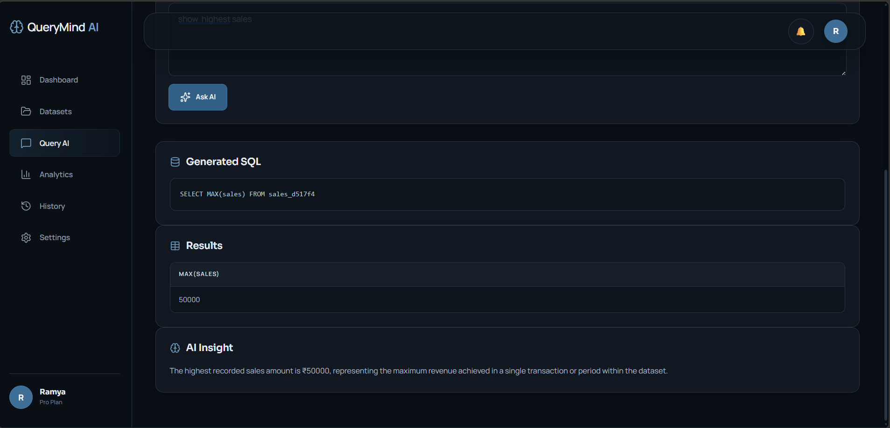
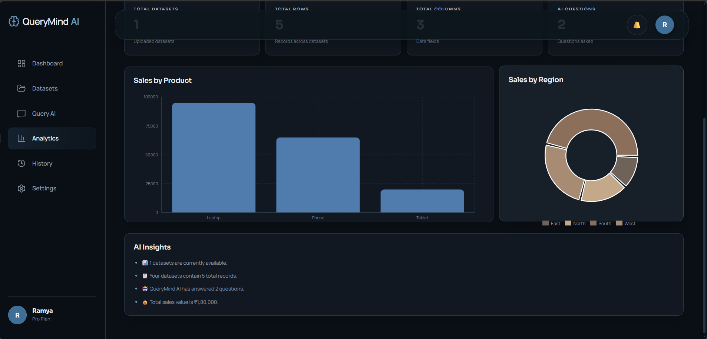

# 🧠 QueryMind AI

> Ask questions. Get answers. No SQL required.

QueryMind AI is an AI-powered data analytics platform that lets users interact with CSV datasets using natural language.

Users can upload a dataset, ask questions in plain English, and get results without writing SQL manually. Gemini AI converts natural-language questions into SQL, executes the query on a SQLite database, and presents the results through an interactive interface.

---

## ✨ Features

- 📂 Upload and preview CSV datasets
- 💬 Ask questions using natural language
- 🤖 Generate SQL queries using Gemini AI
- 🗄️ Execute queries using SQLite
- 📊 Visualize query results
- 💡 Generate AI-powered insights
- 🕘 View query history
- 🎨 Interactive analytics dashboard

---

## 🧠 How It Works

User
  ↓
Upload CSV
  ↓
SQLite Database
  ↓
Natural Language Question
  ↓
Gemini AI
  ↓
SQL Query
  ↓
Query Execution
  ↓
Results
  ↓
Charts & AI Insights

QueryMind AI uses a Natural Language → SQL pipeline to make structured data analysis accessible to users without SQL knowledge.

## Architecture

┌──────────────┐
│     User     │
└──────┬───────┘
       ↓
┌──────────────┐
│    React     │
│   Frontend   │
└──────┬───────┘
       ↓
┌──────────────┐
│   FastAPI    │
│   Backend    │
└──────┬───────┘
       ↓
┌──────────────┐
│  Gemini AI   │
│   NL → SQL   │
└──────┬───────┘
       ↓
┌──────────────┐
│    SQLite    │
└──────┬───────┘
       ↓
┌──────────────┐
│   Results    │
│   & Charts   │
└──────────────┘

## Tech Stack

### Frontend
- React
- Vite
- JavaScript
- Axios
- React Router
- Lucide React

### Backend
- Python
- FastAPI
- Pandas
- SQLite
- Pydantic

### AI
- Google Gemini API
- Google GenAI SDK

## Project Structure

QueryMind-AI/
│
├── Backend/
│   ├── app.py
│   ├── requirements.txt
│   ├── uploads/
│   └── .env
│
├── Frontend/
│   ├── src/
│   ├── package.json
│   └── vite.config.js
│
├── datasets/
├── screenshots/
├── docs/
├── .gitignore
└── README.md

## Getting Started

### Prerequisites
- Python 3.10+
- Node.js
- npm
- Gemini API Key

1. Clone the Repository

git clone https://github.com/YOUR_USERNAME/QueryMind-AI.git
cd QueryMind-AI

2. Backend Setup

cd Backend
python -m venv venv
venv\Scripts\activate
pip install -r requirements.txt
Create a .env file:
GEMINI_API_KEY=your_gemini_api_key_here
Run the backend:
uvicorn app:app --reload

3. Frontend Setup

Open a new terminal:
cd Frontend
npm install
npm run dev

## Screenshots

### Landing Page

### Dashboard

### Dataset Management

### Natural Language Querying

### Generated SQL, Results & AI Insight

### Analytics Dashboard

## Live Demo

Live Application:
https://query-mind-ai-eight.vercel.app

## Future Improvements

- Support for multiple datasets
- Improved SQL validation
- Automatic chart recommendations
- Advanced anomaly detection
- Query correction and retry
- Support for larger databases
- User authentication

## Author

Kommanaboyena Ramyasri
Computer Science & Engineering Student

⭐ If you found QueryMind AI interesting, consider giving the repository a star!
